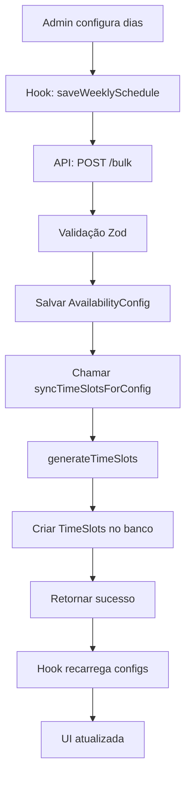

# Sistema de Agendamentos - Implementação Completa

## ✅ O que foi implementado

### 1. Schema Zod Compartilhado
**Arquivo:** `src/lib/validations/availability-config.schema.ts`

- ✅ Validação reutilizável entre front e back
- ✅ Tipos TypeScript inferidos automaticamente
- ✅ Validações de formato (HH:MM)
- ✅ Validações lógicas (endTime > startTime)
- ✅ Schema para operações bulk

### 2. Serviço de TimeSlots
**Arquivo:** `src/lib/timeslot-service.ts`

Funções implementadas:
- ✅ `generateTimeSlots()` - Gera slots baseado em horários e duração
- ✅ `syncTimeSlotsForConfig()` - Sincroniza slots de uma configuração
- ✅ `syncAllTimeSlots()` - Regenera todos os slots do sistema
- ✅ `getAvailableSlots()` - Busca slots disponíveis por data/dia

**Lógica:**
```
Horário: 09:00 - 18:00
Duração: 30 minutos
Pausa: 12:00 - 13:00

Resultado:
09:00-09:30 ✅
09:30-10:00 ✅
10:00-10:30 ✅
...
11:30-12:00 ✅
12:00-12:30 ❌ (pausa)
12:30-13:00 ❌ (pausa)
13:00-13:30 ✅
...
17:30-18:00 ✅
```

### 3. API Bulk
**Arquivo:** `src/app/api/availability-configs/bulk/route.ts`

**Endpoint:** `POST /api/availability-configs/bulk`

**Payload:**
```json
{
  "configs": [
    {
      "dayOfWeek": 1,
      "startTime": "09:00",
      "endTime": "18:00",
      "slotDurationMinutes": 30,
      "capacityPerSlot": 20,
      "isActive": true,
      "isException": false,
      "breakPeriods": [
        {
          "id": "break-123",
          "startTime": "12:00",
          "endTime": "13:00"
        }
      ]
    }
  ]
}
```

**Comportamento:**
- Cria ou atualiza configurações (upsert automático)
- Gera TimeSlots automaticamente para cada config
- Retorna total de configurações e slots criados
- Tudo em transação (atomicidade garantida)

### 4. Hook Atualizado
**Arquivo:** `src/hooks/use-capacity-management.ts`

**Nome:** `useAvailabilitySchedule()`

**Estado:**
```typescript
weekConfig: DayConfig[] // 7 dias da semana com configurações
loading: boolean
saving: boolean
```

**Métodos:**
- `toggleDay(dayOfWeek)` - Ativa/desativa dia
- `updateDayField(dayOfWeek, field, value)` - Atualiza config
- `addBreakPeriod(dayOfWeek)` - Adiciona pausa
- `removeBreakPeriod(dayOfWeek, breakId)` - Remove pausa
- `updateBreakPeriod(...)` - Edita pausa
- `saveWeeklySchedule()` - Salva tudo via bulk API

### 5. Componente UI
**Arquivo:** `src/app/features/booking/Capacity/page.tsx`

**Features:**
- ✅ Resumo visual (dias ativos, slots médios, capacidade média)
- ✅ Checkbox por dia para ativar/desativar
- ✅ Inputs de horário (início/fim)
- ✅ Input de duração de slot
- ✅ Input de capacidade por slot
- ✅ Gerenciamento de pausas (adicionar/remover/editar)
- ✅ Cálculo em tempo real de quantos slots serão gerados
- ✅ Botão de salvar com loading state

### 6. Migração de Banco
**Arquivo:** `prisma/migrations/20251113145925_update_availability_timeslot_schemas/migration.sql`

**Mudanças no schema:**

**AvailabilityConfig:**
```prisma
model AvailabilityConfig {
  // ... campos existentes
  breakPeriods Json @default("[]") // NOVO!
}
```

**TimeSlot:**
```prisma
model TimeSlot {
  id String @id @default(cuid())
  availabilityConfigId String?
  
  dayOfWeek Int? // Para slots regulares (0-6)
  date DateTime? @db.Date // Para exceções
  
  startTime String // "09:00" (antes era DateTime)
  endTime String   // "18:00" (antes era DateTime)
  
  totalCapacity Int // Capacidade total
  availableCapacity Int // Disponível após reservas
  isAvailable Boolean
  
  // Relações
  availabilityConfig AvailabilityConfig?
  bookings Booking[]
}
```

## 🔄 Fluxo Completo do Sistema



## 📊 Exemplo Prático

### Configuração feita no Admin:
```
Segunda-feira:
- Ativo: ✅
- Horário: 09:00 - 18:00
- Duração do slot: 30 min
- Capacidade por slot: 20 pessoas
- Pausas: 12:00-13:00, 15:00-15:30
```

### TimeSlots gerados automaticamente:
```sql
INSERT INTO TimeSlot (dayOfWeek, startTime, endTime, totalCapacity, availableCapacity)
VALUES 
  (1, '09:00', '09:30', 20, 20),
  (1, '09:30', '10:00', 20, 20),
  (1, '10:00', '10:30', 20, 20),
  (1, '10:30', '11:00', 20, 20),
  (1, '11:00', '11:30', 20, 20),
  (1, '11:30', '12:00', 20, 20),
  -- 12:00-13:00 pulado (pausa)
  (1, '13:00', '13:30', 20, 20),
  (1, '13:30', '14:00', 20, 20),
  (1, '14:00', '14:30', 20, 20),
  (1, '14:30', '15:00', 20, 20),
  -- 15:00-15:30 pulado (pausa)
  (1, '15:30', '16:00', 20, 20),
  (1, '16:00', '16:30', 20, 20),
  (1, '16:30', '17:00', 20, 20),
  (1, '17:00', '17:30', 20, 20),
  (1, '17:30', '18:00', 20, 20);
  
-- Total: 15 slots de 30 minutos
```

### Cliente fazendo reserva:
```typescript
// 1. Buscar slots disponíveis para uma segunda-feira
const slots = await getAvailableSlots({ dayOfWeek: 1 });

// 2. Criar booking para um slot
await prisma.booking.create({
  data: {
    customerId: "...",
    timeSlotId: slots[0].id, // 09:00-09:30
    status: "CONFIRMED"
  }
});

// 3. Atualizar capacidade do slot
await prisma.timeSlot.update({
  where: { id: slots[0].id },
  data: {
    availableCapacity: { decrement: 1 } // 20 -> 19
  }
});
```

## 🚀 Como usar

### 1. Iniciar servidor de desenvolvimento:
```bash
npm run dev
```

### 2. Acessar página de configuração:
```
http://localhost:3000/features/booking/Capacity
```

### 3. Configurar dias da semana:
- Marcar checkbox dos dias que funcionam
- Definir horários
- Adicionar pausas se necessário
- Clicar em "Salvar Configuração"

### 4. Sistema gera slots automaticamente!

## 🔧 Manutenção

### Regenerar todos os slots:
```typescript
import { syncAllTimeSlots } from "@/lib/timeslot-service";

// Em um script ou API admin
await syncAllTimeSlots();
```

### Adicionar validação customizada:
```typescript
// src/lib/validations/availability-config.schema.ts
export const availabilityConfigSchema = z.object({
  // ... campos existentes
}).refine(
  (data) => {
    // Sua validação aqui
    return true;
  },
  { message: "Mensagem de erro" }
);
```

### Adicionar campo novo:
1. Atualizar `prisma/schema.prisma`
2. Criar migração: `npx prisma migrate dev`
3. Atualizar schema Zod
4. Atualizar interface `DayConfig` no hook
5. Adicionar input no componente UI

## 📝 Próximos Passos Sugeridos

1. **Datas Especiais/Exceções:**
   - Interface para adicionar feriados
   - Sobrescrever config regular para data específica

2. **Visualização de Slots:**
   - Página para ver slots gerados
   - Indicador de disponibilidade em tempo real

3. **Histórico:**
   - Auditoria de mudanças nas configs
   - Log de slots gerados/deletados

4. **Notificações:**
   - Avisar quando slots são gerados
   - Alertar sobre conflitos/erros

5. **Testes:**
   - Unit tests para `generateTimeSlots()`
   - Integration tests para API bulk
   - E2E tests do fluxo completo
